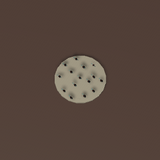

# NAME

ArrowRain

# USAGE

## RandomSampleScene

1. Open RandomSampleScene
1. Play the Editor
1. Select RandomShooter GameObject in Source GameObject
1. In Inspector, click gizmo icon to open context menu
1. Click `Fire`
1. The, arrows goes from source to destination

## KMeanSampleScene

1. Open KMeanSampleScene
1. Play the Editor
1. Select KMeanShooter GameObject in Source GameObject
1. In Inspector, click gizmo icon to open context menu
1. Click `Fire`
1. The, arrows goes from source to destination

